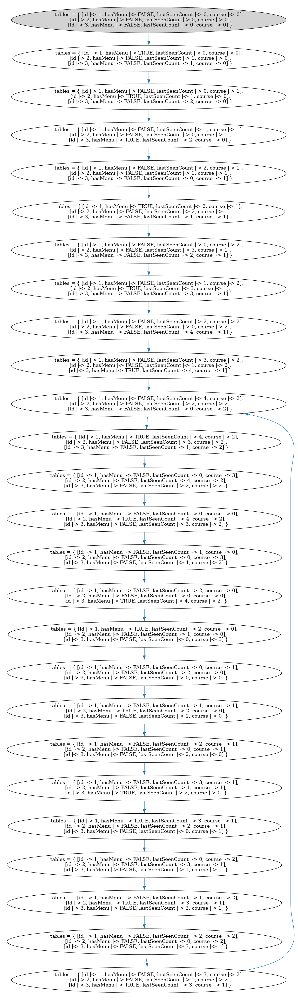

# Shared Menu

A certain restaurant has only one menu that is shared between all its 
tables. The owner implemented a system where each table has a count that
represents the number of tables that have seen the menu since that table's
last possession. Once a table gets a menu, it orders its next course and 
hands the menu to the next table (either directly or via a waiter). Which
table is next is decided by whoever has waited the longest for the menu,
with preference given to patrons who have arrived earlier (for example 
by subtracting their course number from the time since they've last seen
the menu).

Note: After implementing this idea, it's a lot less interesting than 
I thought it'd be. It's completely deterministic (judging by the 
model output), so some modification would have to be made to this
idea to get some non-determinism in the system.

On the other hand it was good practice using several TLA+ concepts

## Generating the model image

The dot file can be generated with the following command:

`java -jar path/to/tla2tools.jar -deadlock  Nim.tla -dump dot,colorize model.dot`

and the dot file can be converted to a png like so:

`dot -Tpng model.dot > model.png`
