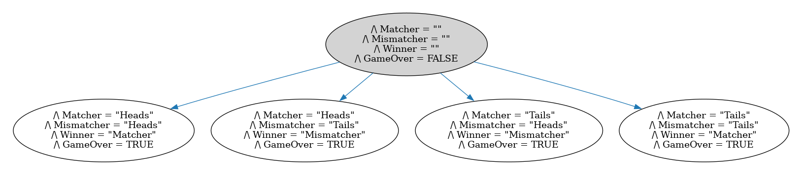

#Matching Pennies Game
This is the canonical zero sum game used to introduce the concept in game theory classes. The model will have 5 states, as shown in the following output generated by the model checker: 

## Generating the model image

The dot file can be generated with the following command:

`java -jar path/to/tla2tools.jar -deadlock  MatchingPennies.tla -dump dot,colorize model.dot`

and the dot file can be converted to a png like so:

`dot -Tpng model.dot > model.png`
