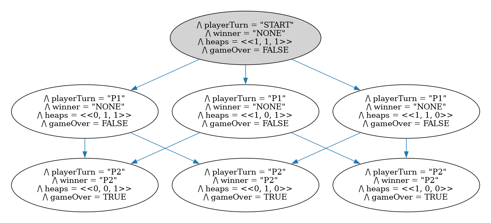

# Nim

Nim is a game where players take turns removing items from heaps. The player who has to take the last item is the loser. Players can take any number of items from one heap each turn. Due to the state explosion that occurs with large heaps (and/or many heaps), this model is a very simple version with three piles of one item each, meaning that the player that goes first always loses: 

## Generating the model image

The dot file can be generated with the following command:

`java -jar path/to/tla2tools.jar -deadlock  Nim.tla -dump dot,colorize model.dot`

and the dot file can be converted to a png like so:

`dot -Tpng model.dot > model.png`
